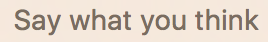
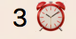

# bitbar-plugins
A collection of [plugins](https://getbitbar.com/) for [BitBar](https://github.com/matryer/bitbar).

## paulgraham
Shows one of [Paul Graham's commands](http://www.paulgraham.com/todo.html) a day.

## timer
Shows time left on a timer.

Meant as a companion to this [Alfred plugin](https://github.com/r1cc4rdo/alfred-workflows/tree/master/timer).